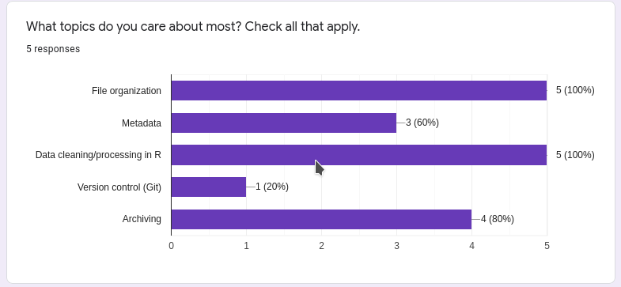
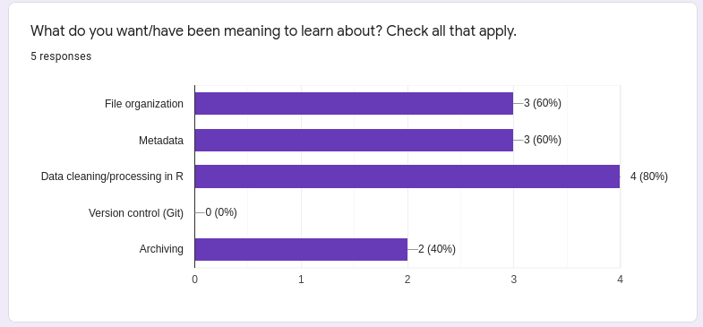
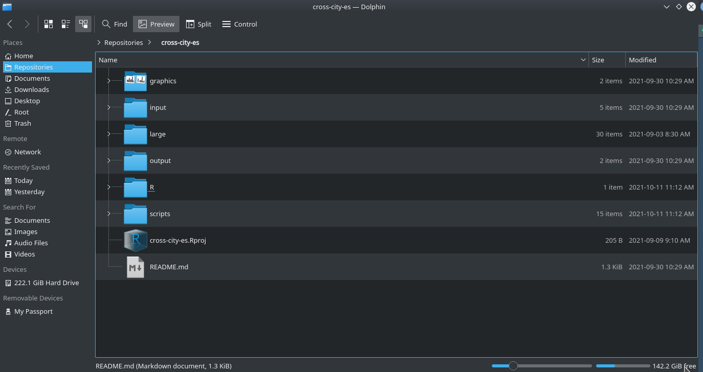
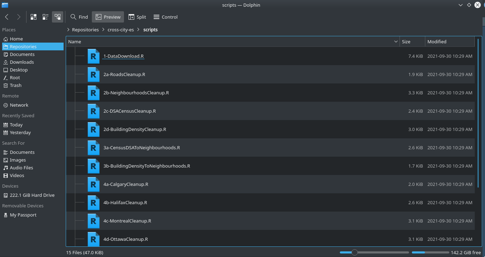

# What we are learning today & why 
- Everyone wants to learn about file organization and data cleaning/processing! So here we go! 

```{r, echo = F}

```

---
# What we are learning today & why 
- Everyone wants to learn about file organization and data cleaning/processing! So here we go! 

```{r, echo = F}

```


---
# A couple notes
- Data archiving in the Ziter lab 
  - We do have a place and and specific formatting requirements for data archiving - we can discuss this more later but this exists (reach out if this is something you want to do in the next couple of weeks)
  
```{r, echo = F}
knitr::include_graphics("righttool.PNG", dpi = 150)
```
.footnote[
[1]: [Scientific Computing](https://sciencecomputing.io)
]


---
class: important
# Part 1: Data & File Organization  
## [Tidy Data](https://www.jstatsoft.org/article/view/v059i10) 
- Tidy data is a framework for how data should be formatted for easy and efficient data cleaning created by [Hadley Wickham](http://hadley.nz/)
  - These principles are the underpinnings of `tidyverse` packages (e.g. ggplot2)   


## Principles 
1. Each variable forms a column
2. Each observation forms a row 
2. Each type of observational unit forms a table

---
class: important 

# Part 1: Data & File Organization  
## Tidy Data 
- The best way to start data/file organization is to use best practices in data collection/spreadsheet formatting 
- There are some really [common spreadsheet errors](https://datacarpentry.org/spreadsheet-ecology-lesson/02-common-mistakes/index.html) that ecologists often use when collecting data 
- We are not going to format a spreadsheet today, but I'd encourage you to take a look at that link and incorporate suggestions next time you're collecting/inputting data


---
class: important 
# Part 1: Data & File Organization 
Good file structure is important because it: 
- Ensures the integrity of your data 
- Makes it easier to share your code with people 
- Makes it easier to upload your code/data with manuscript submission 
- Makes it easier to come back after a break 

Best practices include (but are not limited to): 
- Use an R Project file so that your project is easily shareable
- Always treat raw data as read-only
- Store cleaned data in a separate folder (or distinguish clearly)
- Treat output as disposable - you should always be able to re-generate with script
- Have separate function and figure scripts

.footnote[
[1]: [Software Carpentry Project Management](https://swcarpentry.github.io/r-novice-gapminder/02-project-intro/index.html)
]

---
class: important 

# Part 1: Data & File Organization

This is how I set up my file structure with my R Projects. If you want more examples, most of my repositories on [GitHub](https://github.com/icrichmond/) are set up in in the same (or very similar manner): 

```{r, echo = F}

```

---
class: important 

# Part 1: Data & File Organization

This is how I set up my file structure with my R Projects. If you want more examples, most of my repositories on [GitHub](https://github.com/icrichmond/) are set up in in the same (or very similar manner): 

```{r, echo = F}

```

---
class: review
# Part 2: File Organization Practice 
All together now! 
- We are going to download messy and unstructured GitHub folder from [here](https://github.com/icrichmond/ZULE-data-cleaning-workshop) & unzip 
- Then we are going to set up an R project & the file structure we just talked about  


Ok... Moving on to cleaning data in R! 

---
class: important 
# Part 3: Cleaning Data in R 
- Importance, why, philosophy 

---
class: important
# Part 3: Cleaning Data in R 
- tidyverse & data.table (OpenRefine)

---
class: important
# Part 3: Cleaning Data in R 
- common errors/difficulties

---
# Part 4: Practice cleaning messy Data in R
- import data 
-identify and clean mistakes within the dataset using tidyverse and/or data.table 
- save & export data 


